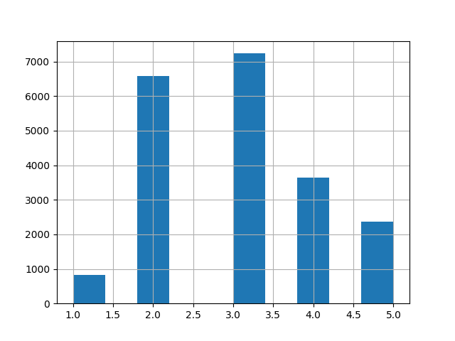

# Notes to the chapter 1

## Building a new ML project

Usually all ML projects can be built based on the following plan:

1. Look at the big picture 
   * Business scope: task, target, application, focus 
   * Current situation: process, costs, errors 
   * ML model: task type, algorithm, data update, quality criteria
2. Get the data.
3. Discover and visualize the data to gain insights.
    * checking dependencies, distribution
    * identifying the most important features
    * validate: data is representative?
4. Prepare the data for Machine Learning algorithms.
    * cleaning up data: missing values, normalizing etc.
    * applying stratification
5. Select a model and train it.
6. Fine-tune your model.
7. Present your solution.
8. Launch, monitor, and maintain your system.

## Glossary

- Data snooping bias—recognizing data patterns, existing only in a concreate dataset
and disappearing with the first check on new data.
- Stratified sampling is a method that ensures the sample contains representative 
proportions of different classes/groups compared to the overall population. 
It is typically done by dividing the population into strata (subgroups) 
and then sampling from each stratum.

## Useful Python insights

- DataFrame—the primary data structure in pandas, 
representing a two-dimensional table similar to 
an Excel worksheet. It consists of rows and columns, 
where each column can hold a different data type (e.g., 
strings, integers, dates).
- head()—method used to quickly inspect the beginning of a 
DataFrame by returning the first 5 rows.
- info()—method used to get a short summary about data (number of rows, 
each attribute type, None values number)
- value_counts() - method for counting non-numerical values appearance 
- describe()—method for getting a statistical summary for numerical attributes (
count, mean, std. min, percentiles, max)
- hist() - matplotlit.pyplot - drawing a histogram: bin - detalization (higher -> more details),
figsize - graph size (i.e. 20 - width, 15 - high)

- train_test_split() - sklearn.model_selection - supports a dataset splitting to
a train and test ones. Params: dataset, test_size, random_state (repetitive split)

- cut() - pd -  a pandas function for binning continuous numerical data into intervals. 
Parameters: data array, bins (number of intervals or bin edges),
labels (optional names for the intervals).

