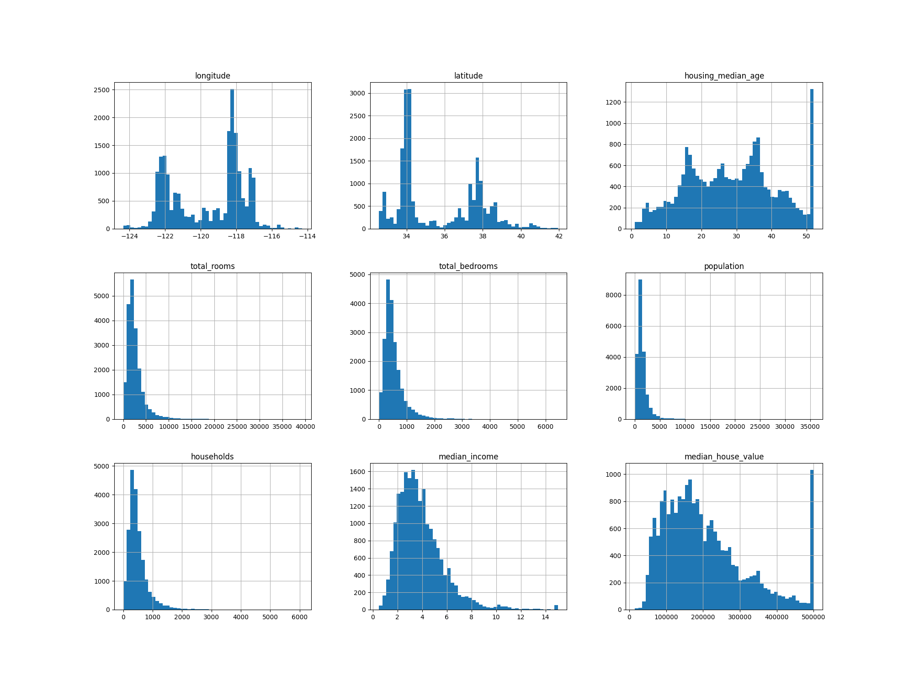
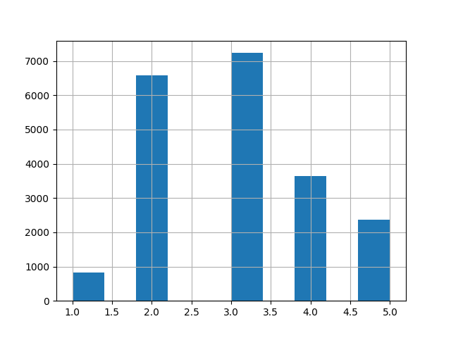

# Notes to the chapter 1

## Building a new ML project

Usually all ML projects can be built based on the following plan:

1. Look at the big picture 
   * Business scope: task, target, application, focus 
   * Current situation: process, costs, errors 
   * ML model: task type, algorithm, data update, quality criteria
2. Get the data:
    * checking dependencies, distribution
    * identifying the most important features
    * validate: data is representative?
    * applying stratification
3. Discover and visualize the data to gain insights. [Data Exploration](data_exploration.md)
   * scatter matrix visualization
   * correlation matrix (target variable vs others)
   * scatter matrix with selected features
   * checking attributes combinations - feature engineering
4. Prepare the data for Machine Learning algorithms.
5. Select a model and train it.
6. Fine-tune your model.
7. Present your solution.
8. Launch, monitor, and maintain your system.

## Glossary

- Data snooping bias—recognizing data patterns, existing only in a concreate dataset
and disappearing with the first check on new data.
- Stratified sampling is a method that ensures the sample contains representative 
proportions of different classes/groups compared to the overall population. 
It is typically done by dividing the population into strata (subgroups) 
and then sampling from each stratum.

## Libraries

* NumPy — operations with numerical arrays
* SciPy — advanced numerical and statistical computations
* Pandas — tabular data processing
* Matplotlib — data visualization
* Scikit-Learn — machine learning library

### Scikit-Learn

* Estimator — learns parameters from data using fit()
    * input: dataset, and labels for supervised learning 
    * hyperparameters define estimator behavior (set before fit)
* Transformer — transforms data using transform()
  * computes transformation parameters during fit()
  * fit_transform() = fit() + transform()
* Predictor — produces predictions using predict()
  * provides score() to evaluate model performance

The same object can be simultaneously Estimator + Transformer and Estimator + Predictor

## Useful Python insights

* DataFrame—the primary data structure in pandas, 
representing a two-dimensional table similar to 
an Excel worksheet. It consists of rows and columns, 
where each column can hold a different data type (e.g., 
strings, integers, dates).
* head()—method used to quickly inspect the beginning of a 
DataFrame by returning the first 5 rows.
* info()—method used to get a short summary about data (number of rows, 
each attribute type, None values number)
* value_counts() - method for counting non-numerical values appearance 
* describe()—method for getting a statistical summary for numerical attributes (
count, mean, std. min, percentiles, max)
* hist() - matplotlit.pyplot - drawing a histogram: bin - detalization (higher -> more details),
figsize - graph size (i.e. 20 - width, 15 - high)

* train_test_split() - sklearn.model_selection - supports a dataset splitting to
a train and test ones. Params: dataset, test_size, random_state (repetitive split)
* cut() - pd -  a pandas function for binning continuous numerical data into intervals. 
Parameters: data array, bins (number of intervals or bin edges),
labels (optional names for the intervals).

* loc - pd - a pandas function for selecting data by labels or by boolean arrays
* StratifiedShuffleSplit - sklearn.model_selection - creates train/test splits while preserving 
the class distribution of the target variable. The split() method returns indices for stratified 
random shuffling and partitioning of the data. 
Params StratifiedShuffleSplit: n_splits - number of sets to generate, 
test_size, random_state. Split() expects dataset and column (array)
* drop() - params: axis=1 for columns and 0 for raws, inplace = True (the same set)
* select_dtypes() - selects only datatypes from given arguments 
i.e. include=["int64", "float64"] or include=[np.number],
where np.number stands for all numerical types
* scatter_matrix - pandas.plotting - scatter matrix for selected attributes, where as diagonal histograms and 
scatter plots for pair relationships in other cells are plotted. 
Params: a list of selected numeric features, figsize - display size

* dropna - pandas.DataFrame - removes rows with missing values. 
Param: subset - attribute to be checked, inplace (True) - to modify current dataset
* fillna - pandas.DataFrame - replaces missing values with a specified constant. 
Params: value to replace with, inplace - modify current dataset
* SimpleImputer - sklearn.impute - fills missing values based on learned statistics. 
Params: strategy (mean, median, most_frequent, constant - required: fill_value). 
  * fit() - computes replacement statistics and stores in statistics_. Param: dataset
  * transform() - replaces NaNs using stored statistics
  * result is NumPy array → convert back: pd.DataFrame(X, columns=dataset.columns, index=dataset.index)
* OrdinalEncoder - sklearn.preprocessing - converts categorical features to integer values by 
assigning a unique integer to each category. Suitable when the categories have an inherent order (e.g., “bad”, “average”, “good”).
  * fit_transform() - params: array-like or DataFrame - [[]] -> output: NumPy array of integers
  * categories_ - list of arrays, each containing the categories seen during fitting (one array per encoded feature).
* OneHotEncoder - sklearn.preprocessing - Encodes categorical features as a one-hot (binary) sparse matrix,
creating one column per unique category.
  * fit_transform() - params: array-like or DataFrame -> output: SciPy matrix (NumPy array -> toarray()
  * categories_ - list of arrays, each representing category labels per encoded feature.
* c_ - numpy - concatenates columns horizontally - returns numpy array
* Pipeline — sklearn.pipeline — allows applying sequentially a list of transformers and a final estimator to preprocess and model the data
  * params: list of tuples (name, estimator)
    * name — must be unique and cannot contain “__” (used for parameter access in inner estimators)
  * output: result of the final estimator — usually a NumPy array or model predictions
* ColumnTransformer - sklearn.compose - allows applying different transformations to different subsets of features. 
Supports DataFrame
  * params: 
    * list of tuples: (name, transformer, list_of_columns)
    * remainder: 
      * drop (default) - dropping columns, 
      * passthrough - no changes, 
      * Pipeline() or transformer to the rest i.e. ColumnTransformer([...], remainder=StandardScaler())
  * output: NumPy matrix — dense (numpy.ndarray) or sparse (scipy.sparse.csr_matrix), depending on transformers used
* iloc - pandas - allows selecting rows and columns in a DataFrame by integer position rather than by labels.
  * params: [:] and [:,]
* cross_val_score - sklearn.model_selection - evaluates a model using cross-validation.
  * params:
    * model — to be evaluated (must implement fit() and predict())
    * X — feature matrix (training data)
    * y — target values
    * cv — number of folds = iterations
    * scoring — performance metrics
  * output: array of scores, one per fold
* dump - joblib - serializes Python objects to disk (commonly used for saving scikit-learn models, pipelines, or transformers)  
  * params:
    * obj (model)
    * filename

