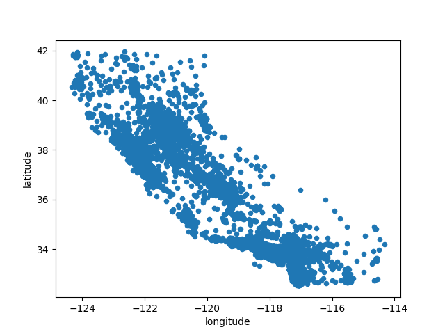
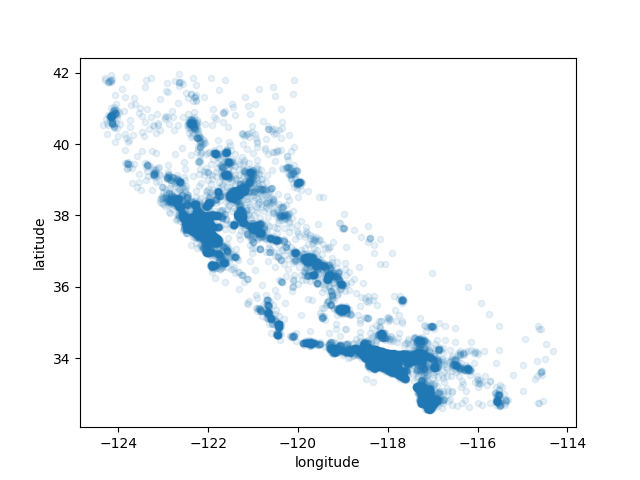
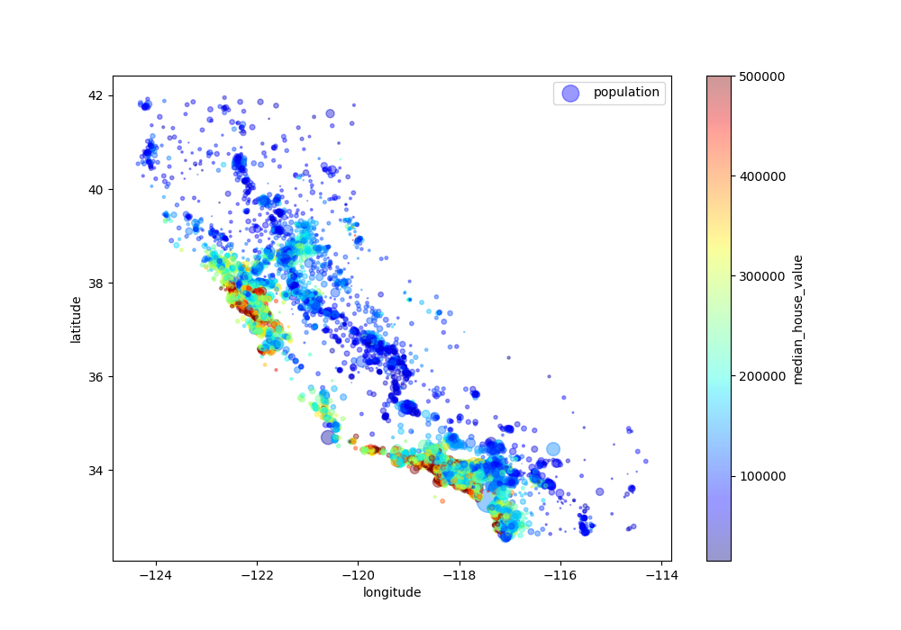

# Step of data exploration

## Plotting Data

The plot function is used to draw points (markers) in a diagram.

Key parameters:

kind – the type of graph (in this case, "scatter")

x, y – the features plotted on the axes

alpha – transparency level of the points 

## Geographical data

**Without alpha**



**With alpha = 0.1**



The alpha parameter allows adjusting data point transparency, 
highlighting regions with the highest density concentration. 
These areas correspond to the most frequently represented 
data points in the dataset. The resulting scatter plot accurately 
traces California's outline while clearly revealing high-density 
locations like Los Angeles and San Diego.

**Adding additional arguments**

* s – scales the point size (here based on population / 100). The higher the value, the larger the point.
* c – colors the points as an additional dimension (here based on median_house_value).
* cmap – a colormap used for c; in this case "jet" provides a color gradient.
* colorbar=True – adds a color bar that helps interpret the colors.



From the graph, it is clear that the closer to the Bay Area, the higher the housing prices and population density become.


## Data correlation

To compute a correlation matrix (Pearson’s r), it is important to first select only numeric features, 
since the correlation matrix cannot process categorical attributes without converting them to numbers.

Once completed, the .corr() method can be applied to compute the correlation between all pairs of features.
It returns a DataFrame object.

Since median_house_value is the target variable, the correlation between this feature and all 
others is extracted as a pd.Series and presented in descending order:

```
median_house_value    1.000000
median_income         0.687151
total_rooms           0.135140
housing_median_age    0.114146
households            0.064590
total_bedrooms        0.047781
population           -0.026882
longitude            -0.047466
latitude             -0.142673
```

From the table above, it is clear that there is a strong positive correlation between 
median_house_value and median_income: the higher the income, the higher the median house price.

