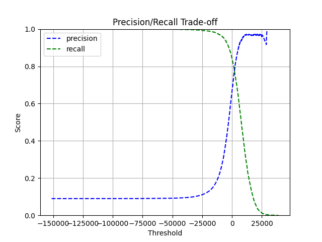

# Classification

Scikit-Learn datasets structure:
- 'DESCR' - dataset description
- 'data' - data points array (DataFrame)
- 'target' - array with labels (Series)

## Learning algorithm

Complementing classical machine learning gradient descent algorithms, scikit-learn provides a stochastic gradient descent (SGD) learning approach.
Compared to classical gradient descent methods, SGD (available in the linear_model module) computes the error between the predicted and actual value not over the entire dataset, but only on a small batch (a subset of samples).

In essence, the algorithm randomly selects one or several data points, makes predictions for them, and updates the model’s weights based on the resulting error.
Repeating this process many times allows the model to update weights faster and more efficiently.
However, the downside of this approach is that the optimization path becomes noisier, and the algorithm might miss the exact optimal weights.

There are several common variants of gradient descent:

| Approach       | How it works   | Remarks                                 |
|----------------|----------------|-----------------------------------------|
| Batch GD       | Entire dataset | Accurate but computationally expensive  |
| Stochastic GD  | Single sample  | Fast but noisy and less stable          |
| Mini-Batch GD  | Small subset   | A trade-off between speed and accuracy  |

## Accuracy metrics
To evaluate classification model performance, multiple metrics can be used. One useful approach is to compare the model against a baseline 
predictor—for example, a classifier that always predicts the same class (e.g., always "False"). This is especially important when dealing 
with imbalanced datasets, where accuracy alone can be misleading (e.g., if 95% of samples belong to one class, a dummy classifier that 
always predicts that class achieves 95% accuracy but is useless in practice). 

Different metrics can evaluate classification model's performance:
1. **accuracy** as the number of correctly classified inputs vs all data points

Example: 
- correctly classified inputs = 90
- total observations = 100

Accuracy: 90/100 = 0.9 or 90%

2. **confusion matrix** as a combination of True/False with their results

[ TRUE NEGATIVES  | FALSE POSITIVES
  FALSE NEGATIVES | TRUE POSITIVES  ]

TN: actual = "False", predicted = "False"
FP: actual = "False", predicted = "True" (Type I error)
FN: actual = "True", predicted = "False" (Type II error)
TP: actual = "True", predicted = "True"

3. **precision** the proportion of true positives among all instances predicted as positive.
Interpretation: Of all instances labeled as "5", how many were actually "5"?

Formula: TP / (TP + FP)

4. **recall** or **sensitivity** the proportion of actual positives that were correctly identified.
Interpretation: Of all actual "5"s, how many did the model find?

Formula: TP / (TP + FN)

5. **F1 score** the harmonic mean of precision and recall. It balances both metrics into a single value, 
especially useful when class distribution is uneven or when you need to compare models with different 
precision/recall trade-offs.. 

Formula: F1 = 2 * (precision * recall)/(precision + recall)

or

TP / (TP + (FN + FP) / 2)

### Precision/recall trade off
Precision vs. Recall trade-off means that improving precision often reduces recall, and vice versa.
The choice of which metric to prioritize depends on the application context.

As an example of this trade-off, how the SGDClassifier uses a decision threshold can be considered.
Usually, such a classifier computes a score (e.g. using decision_function()), 
and then classifies an instance as True if the score is above the threshold, and False if it is below.

By increasing the threshold:

- Precision tends to increase (fewer false positives),
- But recall decreases (more false negatives).

Scikit-learn does not allow setting the decision threshold directly, but it gives access to the raw scores.
So decision_function() can be used to get the scores and then create custom predictions by comparing those scores to a new threshold.

As can be seen from the graph, recall decreases smoothly as the threshold increases.
This happens because raising the threshold can only remove instances from the positive predictions — it never adds new ones. 
So the number of true positives can only stay the same or go down, which makes recall decrease monotonically (hence the smooth curve).

On the other hand, the precision curve is bumpier.
This is because when we raise the threshold, we might remove a true positive (which lowers precision) or a false positive (which raises precision).
So precision can go up or down at different thresholds — which creates the "bumps" on the curve.

From the graph, we can also see that precision drops significantly once recall goes above 80%.

To choose a threshold for a specific goal (e.g. 90% precision), np.argmax() can be used to find the first index where precision ≥ 0.90, 
and then get the corresponding threshold value (e.g. 5437).

After applying this threshold and making custom predictions:

- Precision = 90.0%
- Recall = 62.6%

This means that among all instances predicted as "positive", 90% were correct, but the model only found 63% of all actual positive cases.

## Useful Python insights

- to_numpy() - conversing an object to a np.ndarray. If from DataFrame, column names are removed
- reshape() - taking np.ndarray array and changing it to a 2D array of a defined size
- imshow() - creating an image, cmap - colormap ("binary" - black and white)

