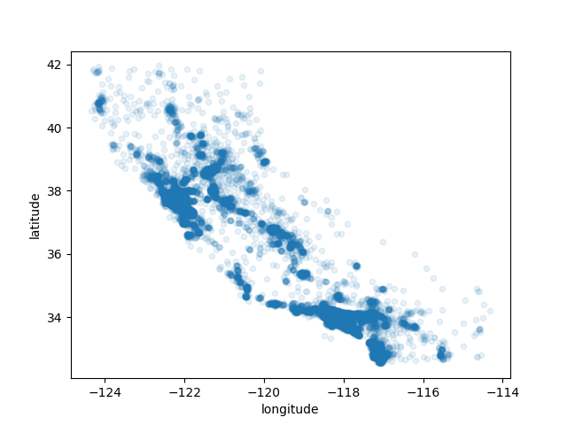
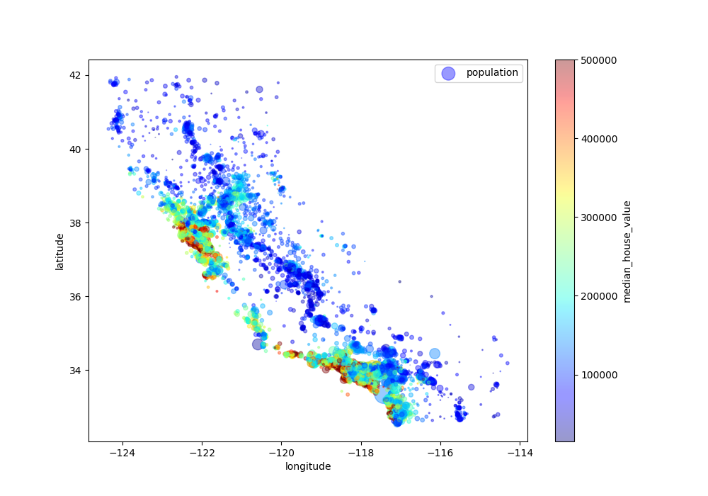
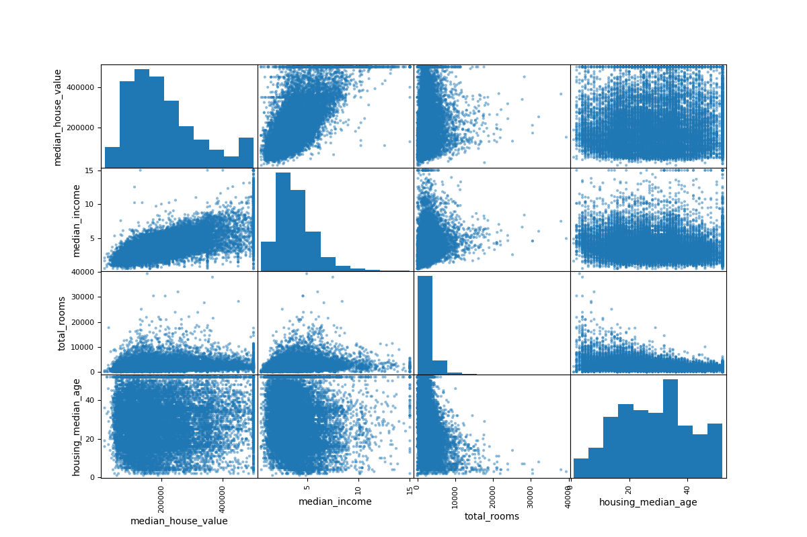

# Step of data exploration

## Plotting Data

The plot function is used to draw points (markers) in a diagram.

Key parameters:

kind – the type of graph (in this case, "scatter")

x, y – the features plotted on the axes

alpha – transparency level of the points 

## Geographical data

**Without alpha**


**With alpha = 0.1**



The alpha parameter allows adjusting data point transparency, 
highlighting regions with the highest density concentration. 
These areas correspond to the most frequently represented 
data points in the dataset. The resulting scatter plot accurately 
traces California's outline while clearly revealing high-density 
locations like Los Angeles and San Diego.

**Adding additional arguments**

* s – scales the point size (here based on population / 100). The higher the value, the larger the point.
* c – colors the points as an additional dimension (here based on median_house_value).
* cmap – a colormap used for c; in this case "jet" provides a color gradient.
* colorbar=True – adds a color bar that helps interpret the colors.



From the graph, it is clear that the closer to the Bay Area, the higher the housing prices and population density become.


## Data correlation

To compute a correlation matrix (Pearson’s r), it is important to first select only numeric features, 
since the correlation matrix cannot process categorical attributes without converting them to numbers.

Once completed, the .corr() method can be applied to compute the correlation between all pairs of features.
It returns a DataFrame object.

Since median_house_value is the target variable, the correlation between this feature and all 
others is extracted as a pd.Series and presented in descending order:

```
median_house_value    1.000000
median_income         0.687151
total_rooms           0.135140
housing_median_age    0.114146
households            0.064590
total_bedrooms        0.047781
population           -0.026882
longitude            -0.047466
latitude             -0.142673
```

From the table above, it is clear that there is a strong positive correlation between 
median_house_value and median_income: the higher the income, the higher the median house price.

### Visualizing correlations using scatter matrix

To visualize relationships between multiple features, we can use scatter_matrix from pandas.plotting.

Since only a few features show noticeable correlation with the target, we focus on the top 4 attributes:



The scatter plots show that median_income has the strongest influence on the target variable:
as income increases, so does housing price.

The zoomed-in plot demonstrates that the data points follow a clear upward trend.
It also reveals several horizontal lines (e.g., at $450k, $350k), which indicate capped values in the dataset.
These outlier-like rows do not represent real market variety 
and might be removed or handled separately during data cleaning.


## Feature Engineering

Some attributes are not informative in their raw form (e.g., total_rooms depends heavily on district population).
By combining features, we can create more meaningful ratios:

rooms_per_household = total_rooms / households

bedrooms_per_household = total_bedrooms / total_rooms

population_per_household = population / households

After adding these features, the updated correlation values show a new significant dependency:

```
median_house_value          1.000000
median_income               0.687151
rooms_per_household         0.146255
total_rooms                 0.135140
housing_median_age          0.114146
households                  0.064590
total_bedrooms              0.047781
population_per_household   -0.021991
population                 -0.026882
longitude                  -0.047466
latitude                   -0.142673
bedrooms_per_household     -0.259952
```

The negative correlation of bedrooms_per_household suggests that districts with fewer bedrooms
per household tend to have higher housing prices.


